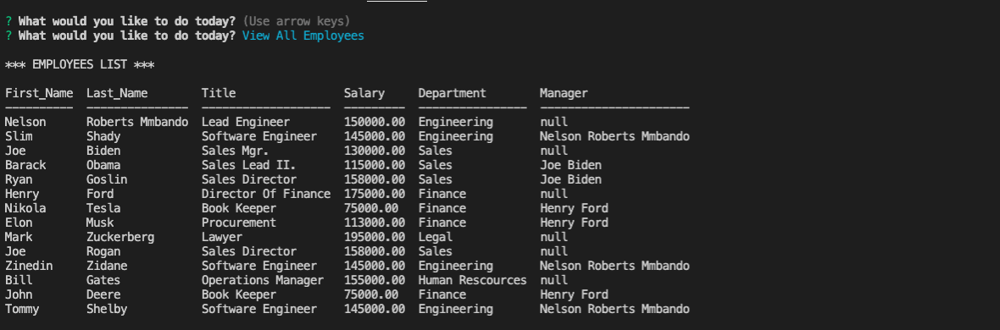
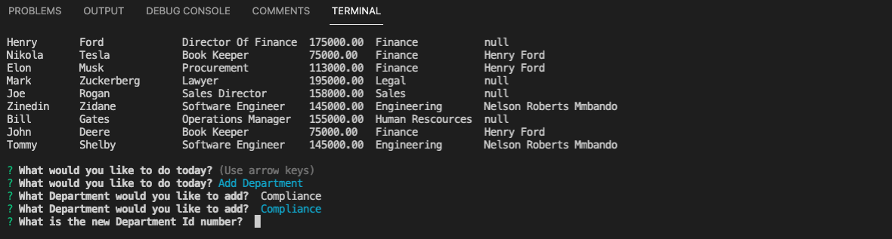
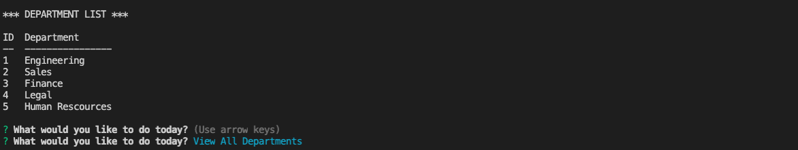

# EMPLOYEE TRACKER
​

Employee Tracker is a Content Mangemant System (CMS) that is built via command line.
The goal of this application is to allow database management for all employees data without the need of writting SQL Queries ie.
Department, Managers, Salary etc.

​

## Screenhsot of the first prompt to get list of all employees once application is loaded

## Department Prompt Adding a Department
​

## Showing A list of availlable Departments 
​

